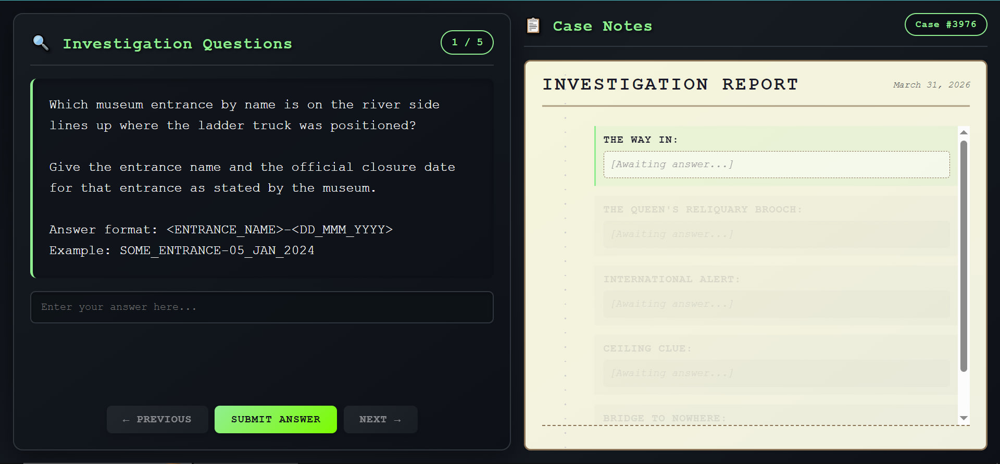
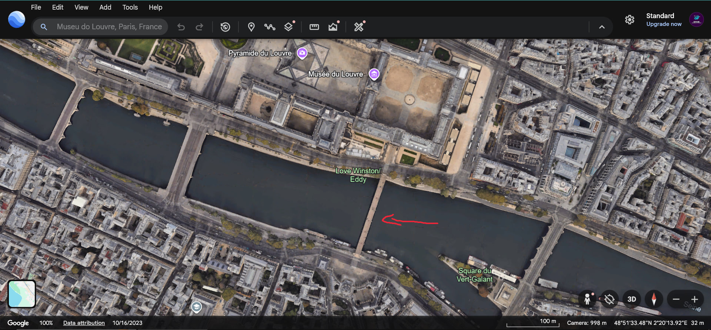
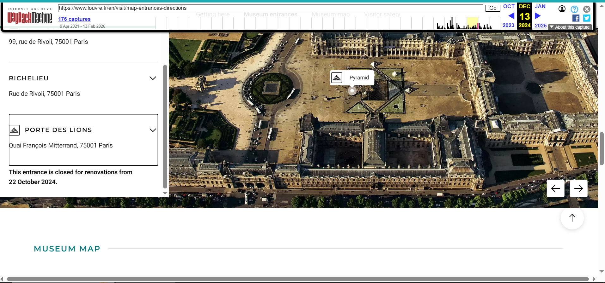
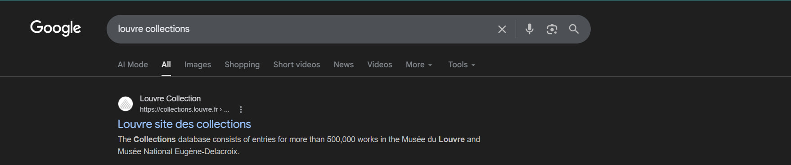
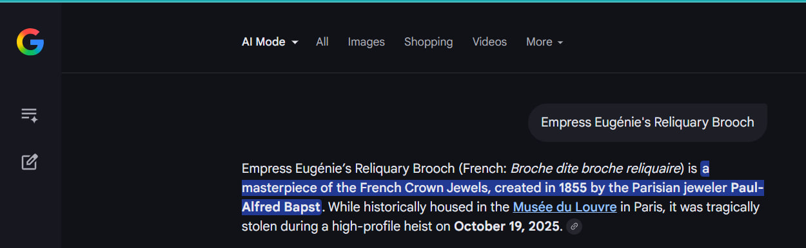
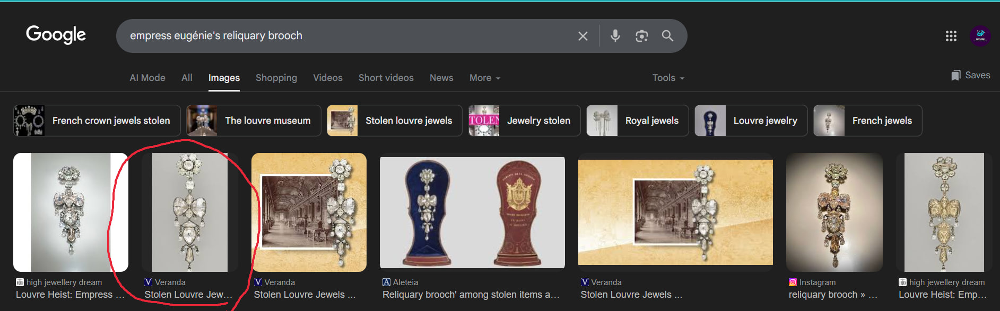
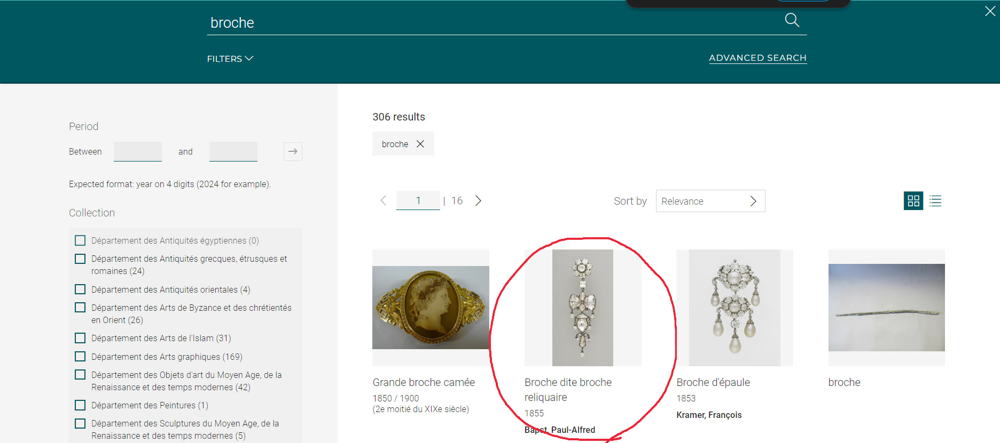
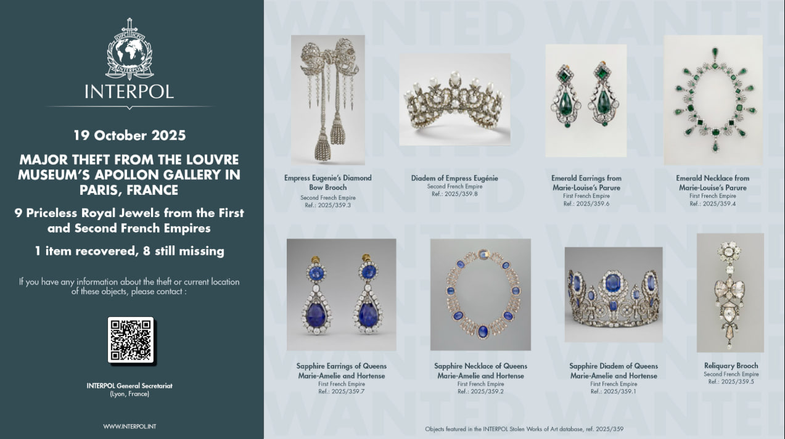
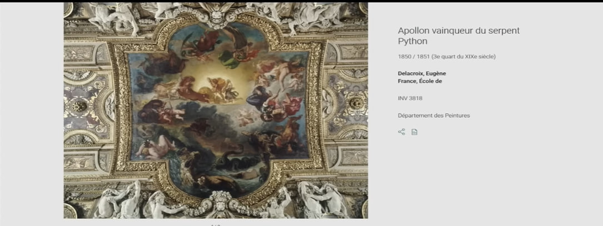
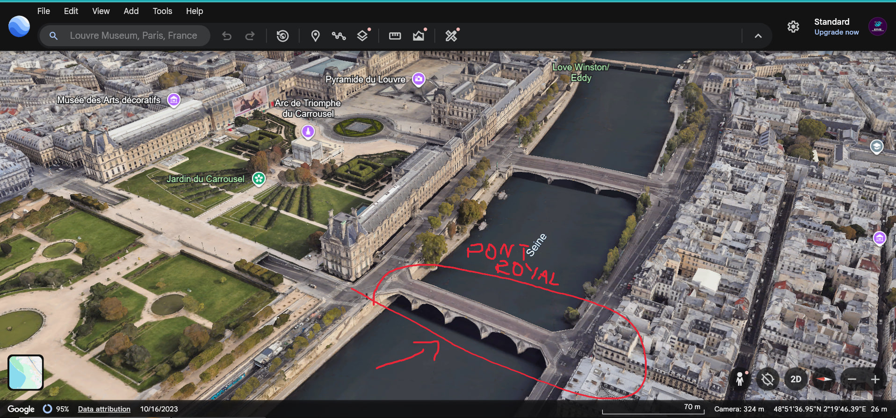

# TryHackMe — The Case: Seven Minutes on the Seine

## Objective

A fictional heist scenario is provided as context: on **19 October 2025**, nine priceless royal jewels from the First and Second French Empires were stolen from the **Galerie d'Apollon** at the Musée du Louvre in Paris. The investigation requires applying open-source intelligence techniques across five questions — identifying the point of entry, researching a stolen artifact in the museum's public collection database, locating INTERPOL reference numbers, identifying the gallery's central ceiling painting, and tracing the most likely escape route across the Seine.



---

## Tools Used

| Tool | Purpose |
|------|---------|
| **Google Earth** | Satellite and 3D imagery for entrance and bridge identification |
| **Wayback Machine** (web.archive.org) | Archived Louvre entrance page with official closure dates |
| **Google Search + AI Mode** | Initial research on the Reliquary Brooch |
| **Google Images** | Visual identification of the brooch in the Louvre collection |
| **Louvre Collections** (collections.louvre.fr) | Official artifact metadata: inventory, maker, acquisition, status |
| **INTERPOL Stolen Works of Art** | Reference IDs for stolen items on the public INTERPOL notice |

---

## Walkthrough

### Step 1 — Museum Entrance Identification via Google Earth and Wayback Machine

The investigation begins by geolocating the Louvre's river-facing entrances. Using **Google Earth**, the south wing of the Louvre complex — the Denon Wing facing the Seine — is examined in satellite view. A red arrow in the aerial view marks the position on the river bank where a ladder truck would have been staged, pointing directly to the **Porte des Lions** entrance located on the Quai François Mitterrand side.



To confirm the official name and obtain the closure date as stated by the museum, the Louvre's entrance and directions page (`louvre.fr/en/visit/map-entrances-directions`) is retrieved from the **Wayback Machine**. The archived snapshot confirms the listing of the **Porte des Lions** entrance at Quai François Mitterrand, with the following notice:

> *"This entrance is closed for renovations from 22 October 2024."*



**Finding — Entrance:** Porte des Lions  
**Finding — Official Closure Date:** 22 October 2024

```
PORTE_DES_LIONS-22_OCT_2024
```

---

### Step 2 — Empress Eugénie's Reliquary Brooch via Louvre Collections

The second question requires identifying four specific metadata fields for Empress Eugénie's Reliquary Brooch from the museum's official collection record.

A Google search for `louvre collections` surfaces the official database at `collections.louvre.fr`.



To establish context on the piece, a Google AI Mode query for `Empress Eugénie's Reliquary Brooch` confirms it is a masterpiece of the French Crown Jewels, created in **1855** by the Parisian jeweler **Paul-Alfred Bapst**.



Google Images is used to visually identify the piece among similar brooches and confirm the correct museum designation.



A search for `broche` within the Louvre Collections database surfaces the entry **"Broche dite broche reliquaire"** by **Bapst, Paul-Alfred** (1855), circled in the results.



The full collection record confirms the required fields:

| Field | Value |
|-------|-------|
| Inventory Number | `MV1024` |
| Maker (Surname) | `BAPST` |
| Acquisition Mode | `Affecté` |
| Acquisition Year | `1887` |
| Location Status | `Non exposé` |

**Finding — Inventory:** MV1024  
**Finding — Maker:** BAPST  
**Finding — Acquisition:** Affecté, 1887  
**Finding — Status:** Non exposé

```
MV1024-BAPST-AFFECTE-1887-NON_EXPOSE
```

---

### Step 3 — INTERPOL Reference IDs via Stolen Works of Art Notice

The third question asks for INTERPOL reference numbers assigned to two of the nine stolen pieces: the **Sapphire Diadem of Queens Marie-Amélie and Hortense**, and the **Reliquary Brooch**.

The INTERPOL public notice for the theft is retrieved. The poster is dated **19 October 2025** and reads:

> *"Major theft from the Louvre Museum's Apollon Gallery in Paris, France — 9 Priceless Royal Jewels from the First and Second French Empires — 1 item recovered, 8 still missing."*

All nine objects are displayed with their individual reference numbers from the INTERPOL Stolen Works of Art database (catalogue ref. 2025/359).



From the notice:

| Item | Reference |
|------|-----------|
| Sapphire Diadem of Queens Marie-Amélie and Hortense | `2025/359.1` |
| Sapphire Necklace of Queens Marie-Amélie and Hortense | 2025/359.2 |
| Empress Eugenie's Diamond Bow Brooch | 2025/359.3 |
| Emerald Necklace from Marie-Louise's Parure | 2025/359.4 |
| **Reliquary Brooch** | `2025/359.5` |
| Emerald Earrings from Marie-Louise's Parure | 2025/359.6 |
| Sapphire Earrings of Queens Marie-Amélie and Hortense | 2025/359.7 |
| Diadem of Empress Eugénie | 2025/359.8 |

**Finding — Sapphire Diadem INTERPOL Ref:** 2025/359.1  
**Finding — Reliquary Brooch INTERPOL Ref:** 2025/359.5

```
2025/359.1,2025/359.5
```

---

### Step 4 — Galerie d'Apollon Ceiling Painting via Louvre Collections

The fourth question asks for the title, inventory number, and dimensions of the central ceiling painting in the **Galerie d'Apollon** — the gallery from which the theft took place.

The Louvre Collections database is queried for the central ceiling work of the Galerie d'Apollon. The record for **"Apollon vainqueur du serpent Python"** (Apollo Victorious over the Serpent Python) by **Eugène Delacroix** is located.



The collection entry confirms:

| Field | Value |
|-------|-------|
| Title | Apollon vainqueur du serpent Python |
| Artist | Delacroix, Eugène |
| Date | 1850 / 1851 |
| Inventory Number | `INV 3818` |
| Department | Département des Peintures |
| Dimensions | 8 m × 7.5 m |

**Finding — Title:** Apollon vainqueur du serpent Python  
**Finding — Inventory:** INV 3818  
**Finding — Dimensions:** 8 m × 7.5 m

```
APOLLON_VAINQUEUR-INV_3818-8mx7.5m
```

---

### Step 5 — Bridge Identification via Google Earth 3D

The final question asks for the bridge lying directly south of the river-side nearest to the Porte des Lions entrance — the most probable escape route across the Seine.

Google Earth is switched to **3D view** with the Louvre complex in frame. The river frontage south of the Porte des Lions (Quai François Mitterrand) is examined. The bridge immediately to the south, crossing the Seine at that position, is annotated directly in the satellite view.



The bridge is identified as **Pont Royal**, the historic bridge linking the Left Bank to the Tuileries Garden side, located directly south of the Porte des Lions entrance.

**Finding — Bridge:** Pont Royal

```
PONT_ROYAL
```

---

## Summary of Findings

| # | Investigation Question | Answer |
|---|----------------------|--------|
| 1 | River-side museum entrance + official closure date | `PORTE_DES_LIONS-22_OCT_2024` |
| 2 | Reliquary Brooch — inventory, maker, acquisition mode/year, status | `MV1024-BAPST-AFFECTE-1887-NON_EXPOSE` |
| 3 | INTERPOL reference IDs (Sapphire Diadem + Reliquary Brooch) | `2025/359.1,2025/359.5` |
| 4 | Galerie d'Apollon ceiling painting — title, inventory, dimensions | `APOLLON_VAINQUEUR-INV_3818-8mx7.5m` |
| 5 | Bridge directly south of the river-side entrance | `PONT_ROYAL` |

---

## Key Observations

- Wayback Machine archived snapshots of institutional websites are a reliable source for recovering time-specific operational data (e.g., entrance closure notices) that may have been removed or updated on the live site.
- Public museum collection databases such as the Louvre's `collections.louvre.fr` expose precise provenance records — including acquisition mode, year, and current display status — which are searchable without authentication.
- INTERPOL's Stolen Works of Art notices are publicly accessible and include structured reference IDs that can be cross-referenced with collection records to build a complete picture of a theft.
- Satellite and 3D imagery in Google Earth enables the reconstruction of physical access and escape routes from a ground-level scenario, using fixed architectural landmarks as reference anchors.
- Cross-referencing multiple open sources (web archives, collection databases, law enforcement notices, geospatial tools) is more reliable than any single source alone.

---

## About

Completed the **"The Case: Seven Minutes on the Seine"** room on TryHackMe — a multi-layered OSINT investigation set against a fictional high-profile art heist at the Musée du Louvre, involving web archive analysis, museum collection database research, INTERPOL stolen art records, and geospatial bridge identification.

Challenge source: [tryhackme.com](https://tryhackme.com)
